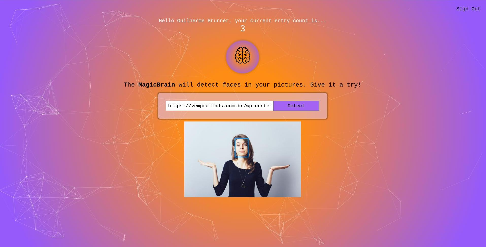

<!-- PROJECT SHIELDS -->
<!--
*** I'm using markdown "reference style" links for readability.
*** Reference links are enclosed in brackets [ ] instead of parentheses ( ).
*** See the bottom of this document for the declaration of the reference variables
*** for contributors-url, forks-url, etc. This is an optional, concise syntax you may use.
*** https://www.markdownguide.org/basic-syntax/#reference-style-links
-->

[![Contributors][contributors-shield]][contributors-url]
[![Forks][forks-shield]][forks-url]
[![Stargazers][stars-shield]][stars-url]
[![Issues][issues-shield]][issues-url]
[![LinkedIn][linkedin-shield]][linkedin-url]

<!-- PROJECT LOGO -->
<br />
<p align="center">
  <a href="https://github.com/sgtbrunner/magicbrain">
    
  </a>

  <h3 align="center">MagicBrain</h3>

  <p align="center">
    A modern web application which identifies faces in images and display its boundaries.
    <br />
    <a href="https://github.com/sgtbrunner/magicbrain"><strong>Explore the docs »</strong></a>
    <br />
    <br />
    <a href="https://sgtbrunner.github.io/magicbrain/">View Demo</a>
    ·
    <a href="https://github.com/sgtbrunner/magicbrain/issues">Report Bug / Request Feature</a>
  </p>
</p>

<!-- TABLE OF CONTENTS -->
<details open="open">
  <summary>Table of Contents</summary>
  <ol>
    <li>
      <a href="#about-the-project">About The Project</a>
      <ul>
        <li><a href="#built-with">Built With</a></li>
      </ul>
    </li>
    <li>
      <a href="#getting-started">Getting Started</a>
      <ul>
        <li><a href="#prerequisites">Prerequisites</a></li>
        <li><a href="#installation">Installation</a></li>
      </ul>
    </li>
    <li><a href="#usage">Usage</a></li>
    <li><a href="#roadmap">Roadmap</a></li>
    <li><a href="#contributing">Contributing</a></li>
    <li><a href="#contact">Contact</a></li>
    <li><a href="#acknowledgements">Acknowledgements</a></li>
  </ol>
</details>

<!-- ABOUT THE PROJECT -->
## About The Project

[![MagicBrain][product-screenshot]](https://sgtbrunner.github.io/magicbrain/)

MagicBrain is a modern web application on which users can sign up for a new user, login with their existing user, submit their favorite friends and family photos and have theirs faces identified.

This project was originally built as part of a Full Stack pratical exercise to expand on React knowledge (including login, hooks and routes) and Rest API building and integration. Later on, tests with Jest and React Testing Library were also added to the project.

### Built With

  MagicBrain was built with the following technologies:

  <div>
    
    
    
    
    
  </div>
  <br />

<!-- GETTING STARTED -->
## Getting Started

To get a local copy up and running follow these simple example steps.

### Prerequisites

Have `npm` installed in your machine.  
* npm
  ```sh
  npm install npm@latest -g
  ```

### Installation
  On terminal

1. Clone the repo
   ```sh
   git clone https://github.com/sgtbrunner/magicbrain
   ```
2. Navigate to project folder
   ```sh
   cd magicbrain
   ```  
3. Install NPM packages
   ```sh
   npm install
   ```

<!-- USAGE EXAMPLES -->
## Usage
  Run the following commands on terminal within the project folder

1. Starting the app
   ```sh
   npm start
   ```
   If you browser doesn't open automatically, open it and navigate to
   ```sh
   http://localhost:3000/
   ```

    To fully benefit from MagicBrain login and face detection capabilities, it is required to either run the [MagicBrain API](https://github.com/sgtbrunner/magicbrain-api/) (default PORT 5000) or point the development environment `REACT_APP_API_ENDPOINT` config constant in the `.env.development` file to `https://mighty-beyond-04256.herokuapp.com`.
    <br />
    <br />
    Once loaded, you can sign up or login onto the app...
    
    <br />
    <br />
    ...submit your favorite family/friend picture and see all the magic happening!
    

2. Formatting the app
   ```sh
   npm run format
   ```

3. Linting the app
   ```sh
   npm run lint
   ```

4. Testing the app
   ```sh
   npm test
   ```

   To check for testing coverage:
   ```sh
   npm run test-coverage
   ```

5. Building the app
   ```sh
   npm run build
   ```

<!-- ROADMAP -->
## Roadmap
See the [open issues](https://github.com/sgtbrunner/magicbrain/issues) for a list of proposed features (and known issues).

<!-- CONTRIBUTING -->
## Contributing

Contributions are what make the open source community such an amazing place to be learn, inspire, and create. Any contributions you make are **greatly appreciated**.

1. Fork the Project
2. Create your Feature Branch (`git checkout -b feature/AmazingFeature`)
3. Commit your Changes (`git commit -m 'Add some AmazingFeature'`)
4. Push to the Branch (`git push origin feature/AmazingFeature`)
5. Open a Pull Request


<!-- CONTACT -->
## Contact

Guilherme Brunner - guilherme.brunner@gmail.com

Project Link: [https://github.com/sgtbrunner/magicbrain](https://github.com/sgtbrunner/magicbrain)


<!-- ACKNOWLEDGEMENTS -->
## Acknowledgements
* [Tachyons](https://tachyons.io/docs/)
* [React Prop-Types](https://www.npmjs.com/package/prop-types)
* [React Particls JS](https://www.npmjs.com/package/react-particles-js)
* [React Loading Overlay](https://www.npmjs.com/package/react-loading-overlay)
* [React Router](https://reactrouter.com/web/guides/quick-start)
* [Eslint](https://eslint.org/)
* [Prettier](https://prettier.io/)
* [Testing Library](https://testing-library.com/)
* [GitHub Pages](https://pages.github.com)

<!-- MARKDOWN LINKS & IMAGES -->
<!-- https://www.markdownguide.org/basic-syntax/#reference-style-links -->
[contributors-shield]: https://img.shields.io/github/contributors/sgtbrunner/magicbrain.svg?style=for-the-badge
[contributors-url]: https://github.com/sgtbrunner/magicbrain/graphs/contributors
[forks-shield]: https://img.shields.io/github/forks/sgtbrunner/magicbrain.svg?style=for-the-badge
[forks-url]: https://github.com/sgtbrunner/magicbrain/network/members
[stars-shield]: https://img.shields.io/github/stars/sgtbrunner/magicbrain.svg?style=for-the-badge
[stars-url]: https://github.com/sgtbrunner/magicbrain/stargazers
[issues-shield]: https://img.shields.io/github/issues/sgtbrunner/magicbrain.svg?style=for-the-badge
[issues-url]: https://github.com/sgtbrunner/magicbrain/issues
[linkedin-shield]: https://img.shields.io/badge/-LinkedIn-black.svg?style=for-the-badge&logo=linkedin&colorB=555
[linkedin-url]: https://linkedin.com/in/guilherme-brunner
[product-screenshot]: src/assets/images/screenshot.jpg

